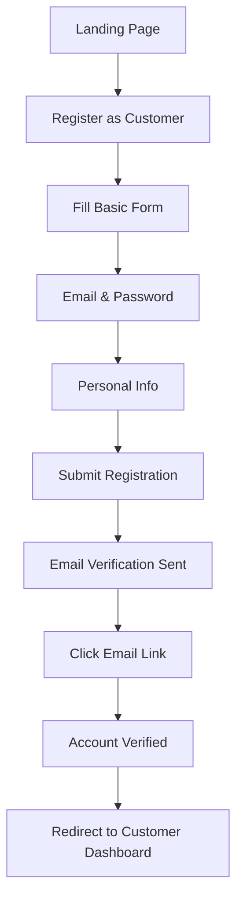
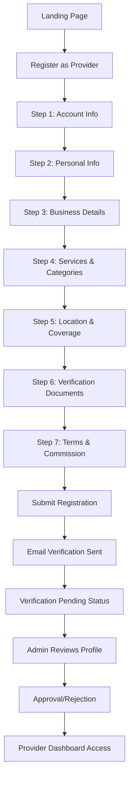

# 🔐 Authentication System - Complete Overview

## 📋 Table of Contents
1. [System Overview](#system-overview)
2. [User Roles & Permissions](#user-roles--permissions)
3. [Registration Flows](#registration-flows)
4. [Authentication Architecture](#authentication-architecture)
5. [Post-Login Routing](#post-login-routing)
6. [Security Features](#security-features)
7. [Database Strategy](#database-strategy)

---

## 🎯 System Overview

### **Platform User Types**
Based on business requirements analysis, our platform supports three distinct user roles:

1. **Customers (Users)** - Service consumers who browse and book services
2. **Service Providers (Partners)** - Business owners who offer services  
3. **Administrators** - Platform managers with full system access

### **Current Implementation Status**
- ✅ **User Model**: Complete with JWT, password hashing, email verification
- ✅ **API Service**: Axios interceptors and token management ready
- ✅ **Database Connection**: MongoDB Compass setup available
- ⏳ **Role-Specific Features**: Need to implement
- ⏳ **Registration Forms**: Need to build
- ⏳ **Dashboard Pages**: Need to create

---

## 👥 User Roles & Permissions

### **1. Customer Role**
```typescript
interface CustomerPermissions {
  role: 'customer';
  canAccess: [
    '/customer/*',           // Customer dashboard area
    '/services',             // Browse services
    '/providers/*',          // View provider profiles
    '/booking/*'             // Booking process
  ];
  cannotAccess: [
    '/provider/*',           // Provider dashboard
    '/admin/*'               // Admin panel
  ];
  capabilities: [
    'browse_services',
    'book_services', 
    'manage_bookings',
    'write_reviews',
    'manage_profile',
    'manage_addresses',
    'manage_payment_methods'
  ];
}
```

### **2. Provider Role**
```typescript
interface ProviderPermissions {
  role: 'provider';
  canAccess: [
    '/provider/*',           // Provider dashboard area
    '/services',             // View all services
    '/customer/booking/*'    // View booking details (own bookings only)
  ];
  cannotAccess: [
    '/customer/dashboard',   // Customer dashboard
    '/admin/*'               // Admin panel
  ];
  capabilities: [
    'create_services',
    'manage_services',
    'manage_availability',
    'view_own_bookings',
    'manage_earnings',
    'manage_business_profile',
    'view_analytics',
    'upload_portfolio',
    'manage_team'
  ];
  restrictions: [
    'cannot_book_services',
    'requires_verification_for_withdrawal',
    'profile_pending_approval'
  ];
}
```

### **3. Admin Role**
```typescript
interface AdminPermissions {
  role: 'admin';
  canAccess: [
    '/admin/*',              // Full admin panel
    '/provider/*',           // View all provider data
    '/customer/*',           // View all customer data
    '/*'                     // Full platform access
  ];
  capabilities: [
    'manage_all_users',
    'manage_providers',
    'approve_services',
    'manage_categories',
    'view_all_analytics',
    'handle_disputes',
    'manage_platform_settings',
    'manage_payments_refunds',
    'content_moderation'
  ];
}
```

---

## 📝 Registration Flows

### **Customer Registration (Simple Flow)**


**Registration Data:**
```typescript
interface CustomerRegistration {
  // Authentication
  email: string;
  password: string;
  confirmPassword: string;
  
  // Personal Info
  firstName: string;
  lastName: string;
  phone?: string;
  dateOfBirth?: Date;
  
  // Preferences
  preferredCategories?: string[];
  notificationPreferences: {
    email: boolean;
    sms: boolean;
    push: boolean;
  };
  
  // Legal
  agreeToTerms: boolean;
  agreeToPrivacy: boolean;
  marketingOptIn?: boolean;
}
```

### **Provider Registration (Multi-Step Flow)**


**Registration Data:**
```typescript
interface ProviderRegistration {
  // Authentication (Step 1)
  email: string;
  password: string;
  confirmPassword: string;
  
  // Personal Info (Step 2) 
  firstName: string;
  lastName: string;
  phone: string;
  dateOfBirth: Date;
  profilePhoto?: File;
  
  // Business Details (Step 3)
  businessName: string;
  businessType: 'individual' | 'company';
  businessDescription: string;
  yearsOfExperience: number;
  
  // Services & Categories (Step 4)
  primaryCategory: string;
  subcategories: string[];
  servicesOffered: string[];
  specializations: string[];
  
  // Location & Coverage (Step 5)
  businessAddress: {
    street: string;
    city: string;
    state: string;
    zipCode: string;
    country: string;
  };
  serviceAreas: string[];
  mobileBusiness: boolean;
  
  // Verification Documents (Step 6)
  identityDocument: File;
  businessLicense?: File;
  certifications?: File[];
  portfolioImages: File[];
  
  // Terms & Agreements (Step 7)
  agreeToProviderTerms: boolean;
  agreeToCommissionStructure: boolean;
  agreeToBackgroundCheck: boolean;
  agreeToInsuranceRequirements?: boolean;
}
```

### **Admin Registration (Admin-Only Creation)**
- Admins can only be created by existing admins
- No public registration form
- Created through admin panel with immediate access

---

## 🏗️ Authentication Architecture

### **JWT Token Structure**
```typescript
interface JWTPayload {
  id: string;              // User MongoDB _id
  email: string;           // User email
  role: 'customer' | 'provider' | 'admin';
  firstName: string;
  lastName: string;
  isEmailVerified: boolean;
  isActive: boolean;
  
  // Token metadata
  iat: number;            // Issued at
  exp: number;            // Expires at
  iss: 'home-service-platform';  // Issuer
}
```

### **Token Management**
- **Access Token**: 15 minutes expiry
- **Refresh Token**: 7 days expiry
- **Email Verification Token**: 24 hours expiry
- **Password Reset Token**: 1 hour expiry

### **Storage Strategy**
- **Access Token**: localStorage (frontend)
- **Refresh Token**: httpOnly cookie (secure)
- **User Data**: Zustand store (frontend)

---

## 🎯 Post-Login Routing

### **Role-Based Dashboard Routing**
```typescript
const postLoginRouting = {
  customer: '/customer/dashboard',
  provider: '/provider/dashboard', 
  admin: '/admin/dashboard'
};

// Dashboard Features by Role
const dashboardFeatures = {
  customer: {
    overview: 'Upcoming bookings, recommendations',
    quickActions: ['Book Service', 'Find Providers', 'View History'],
    widgets: ['Recent Bookings', 'Favorite Providers', 'Loyalty Points']
  },
  
  provider: {
    overview: 'Today\'s schedule, earnings, pending bookings',
    quickActions: ['Manage Availability', 'Add Service', 'View Analytics'],
    widgets: ['Revenue Chart', 'Booking Requests', 'Reviews Summary']
  },
  
  admin: {
    overview: 'Platform KPIs, user growth, revenue metrics',
    quickActions: ['User Management', 'Approve Providers', 'View Reports'],
    widgets: ['User Stats', 'Revenue Dashboard', 'Pending Approvals']
  }
};
```

### **Protected Routes Structure**
```typescript
// Customer Routes (requires customer role)
/customer/dashboard
/customer/profile
/customer/bookings
/customer/bookings/:id
/customer/reviews
/customer/favorites
/customer/addresses
/customer/payment-methods
/customer/loyalty-rewards
/customer/settings

// Provider Routes (requires provider role)
/provider/dashboard
/provider/profile
/provider/services
/provider/services/add
/provider/services/:id/edit
/provider/calendar
/provider/bookings
/provider/bookings/:id
/provider/analytics
/provider/earnings
/provider/portfolio
/provider/settings

// Admin Routes (requires admin role)
/admin/dashboard
/admin/users
/admin/users/:id
/admin/providers
/admin/providers/:id/verify
/admin/services
/admin/categories
/admin/analytics
/admin/transactions
/admin/settings
/admin/reports

// Public Routes (no authentication required)
/
/login
/register
/register/customer
/register/provider
/forgot-password
/reset-password/:token
/verify-email/:token
/services
/services/:category
/providers/:id/public
/about
/contact
/terms
/privacy
```

---

## 🔒 Security Features

### **Password Security**
- **Minimum Requirements**: 8 characters, uppercase, lowercase, numbers, special chars
- **Hashing**: bcrypt with 10 salt rounds
- **History**: Cannot reuse last 3 passwords
- **Reset**: Secure token-based reset with 1-hour expiry

### **Account Security**
- **Login Attempts**: Max 5 failed attempts
- **Account Lockout**: 30 minutes after failed attempts
- **Email Verification**: Required for all new accounts
- **Session Management**: Secure JWT with refresh token rotation

### **API Security**
- **Rate Limiting**: 100 requests per 15 minutes per IP
- **CORS**: Configured for allowed origins only
- **Input Validation**: Joi schemas for all endpoints
- **SQL Injection**: MongoDB sanitization
- **XSS Protection**: Helmet middleware

### **Role-Based Access Control**
```typescript
// Middleware example
const requireRole = (allowedRoles: UserRole[]) => {
  return (req: Request, res: Response, next: NextFunction) => {
    if (!allowedRoles.includes(req.user.role)) {
      return res.status(403).json({ error: 'Access denied' });
    }
    next();
  };
};

// Usage examples
router.get('/customer/dashboard', authenticate, requireRole(['customer']), getDashboard);
router.get('/provider/earnings', authenticate, requireRole(['provider']), getEarnings);
router.get('/admin/users', authenticate, requireRole(['admin']), getAllUsers);
```

---

## 🗄️ Database Strategy

### **MongoDB Configuration**
- **Development**: `mongodb://localhost:27017/home_service_marketplace`
- **Production**: MongoDB Atlas (thedatapros.ldrf6.mongodb.net)
- **Collections**: users, customer_profiles, provider_profiles, service_categories, services, bookings

### **Data Relationships**
```typescript
// User (Base authentication table)
User {
  _id: ObjectId,
  email, password, role,
  firstName, lastName, phone,
  isEmailVerified, isActive,
  // ... authentication fields
}

// Extended profiles based on role
CustomerProfile {
  _id: ObjectId,
  userId: ObjectId,  // References User._id
  preferences, addresses, paymentMethods,
  loyaltyPoints, favoriteProviders
}

ProviderProfile {
  _id: ObjectId, 
  userId: ObjectId,  // References User._id
  businessInfo, services, portfolio,
  verificationStatus, earnings
}

ServiceCategory {
  _id: ObjectId,
  name, slug, description,
  subcategories, icon
}
```

### **Initial Seed Data**
```typescript
// Service categories to populate
const seedCategories = [
  {
    name: "Beauty", 
    slug: "beauty",
    subcategories: ["Hair Styling", "Makeup", "Facials", "Nails"],
    description: "Professional beauty and grooming services"
  },
  {
    name: "Wellness",
    slug: "wellness", 
    subcategories: ["Massage", "Spa Treatments", "Aromatherapy"],
    description: "Relaxation and wellness services"
  },
  {
    name: "Fitness", 
    slug: "fitness",
    subcategories: ["Personal Training", "Yoga", "Pilates", "Nutrition"],
    description: "Health and fitness services"
  },
  {
    name: "Home Care",
    slug: "home-care",
    subcategories: ["Cleaning", "Plumbing", "Electrical", "Gardening"], 
    description: "Home maintenance and care services"
  }
];
```

---

## 🎉 Success Criteria

### **Functional Requirements**
- ✅ Role-based registration (Customer simple, Provider multi-step)
- ✅ Email verification for all accounts
- ✅ Secure JWT authentication with refresh tokens
- ✅ Role-based dashboard routing
- ✅ Protected routes with proper access control
- ✅ Password reset functionality
- ✅ Account lockout security

### **Technical Requirements**
- ✅ MongoDB local development setup
- ✅ Seed data for service categories
- ✅ TypeScript interfaces for all data structures
- ✅ Proper error handling and validation
- ✅ Responsive registration forms
- ✅ Loading states and user feedback

### **Security Requirements**
- ✅ No plain text passwords
- ✅ Secure token management
- ✅ Input validation and sanitization
- ✅ Rate limiting on auth endpoints
- ✅ HTTPS enforcement in production
- ✅ CSRF and XSS protection

---

## 🚀 Implementation Next Steps

1. **Database Setup**: Create collections and seed service categories
2. **Extended Models**: Build ProviderProfile and CustomerProfile models
3. **Auth Controllers**: Implement role-specific registration and login
4. **Registration Forms**: Build multi-step provider and simple customer forms
5. **Dashboard Pages**: Create role-specific dashboard layouts
6. **Route Protection**: Implement middleware for role-based access
7. **Integration Testing**: Verify all flows work end-to-end

---

This overview provides the complete foundation for implementing a secure, role-based authentication system that supports the three distinct user types of our home service marketplace platform.